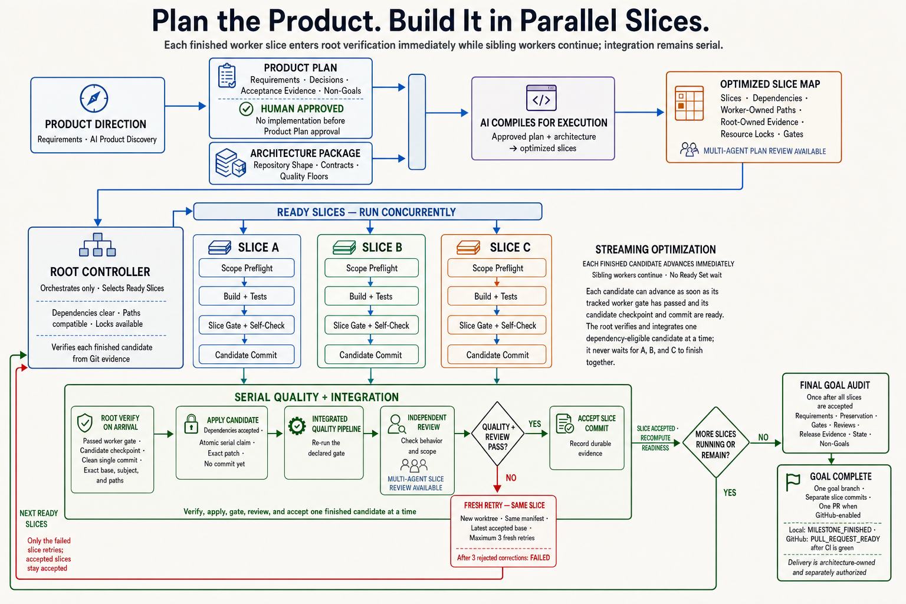

# Parallel Slices

[](https://github.com/jtrefry/parallel-slices/actions/workflows/quality.yml)

**Plan the product. Build it in parallel slices.**

Parallel Slices turns an approved product plan into small, testable
[subfeatures](docs/glossary.md#subfeature) called
[slices](docs/glossary.md#slice) that AI agents build concurrently and verify
serially. You describe the product, answer questions, and approve the plan; AI
builds each slice behind enforced quality gates until one finished goal pull
request is ready for your review. Humans keep every consequential decision.

[Website](https://parallelslices.com) ·
[GitHub](https://github.com/jtrefry/parallel-slices) ·
[Glossary](docs/glossary.md)

> **Status:** Parallel Slices is pre-1.0 software (currently 0.1.0). There is
> no published npm package; cloning this repository and generating or adopting
> a project is the supported path. Versioned releases are planned. See the
> [changelog](CHANGELOG.md).

## Find what you need

| I want to…                                  | Go to                                                                    |
| ------------------------------------------- | ------------------------------------------------------------------------ |
| Understand the idea and process             | [Understand the model](#understand-the-model)                            |
| Look up a term                              | [Glossary](docs/glossary.md)                                             |
| See which files and controls make it work   | [Mechanism map](docs/mechanism-map.md)                                   |
| See what the bundled architecture provides  | [Why start with a bundled architecture](docs/why-parallel-slices.md)     |
| Create a new project                        | [Create a new project](#create-a-new-project)                            |
| Add controls to an existing repository      | [Adopt an existing repository](#adopt-an-existing-repository)            |
| Build a private architecture package        | [Create an architecture package](docs/creating-architecture-packages.md) |
| Understand execution, retries, and recovery | [Operating guide](docs/operating-guide.md)                               |
| Understand the testing philosophy           | [Testing standards](docs/testing-standards.md)                           |
| Browse all guides and reference pages       | [Documentation map](docs/README.md)                                      |
| Work on Parallel Slices itself              | [Develop Parallel Slices](#develop-parallel-slices)                      |

## Quick start

Clone Parallel Slices and run the bootstrap with a creation configuration to
generate an independent product repository. From the directory where you keep
your projects:

```bash
git clone https://github.com/jtrefry/parallel-slices.git
cd parallel-slices
npm ci --ignore-scripts
npm run bootstrap -- \
  --config examples/create/nextjs-gcp-postgres.json \
  /absolute/path/to/my-product
```

The bundled configurations are:

| Configuration                                                                                            | Included stack                                                                          |
| -------------------------------------------------------------------------------------------------------- | --------------------------------------------------------------------------------------- |
| [`examples/create/nextjs-gcp-postgres.json`](examples/create/nextjs-gcp-postgres.json)                   | Next.js, Mantine, PostgreSQL, and a Google Cloud production baseline (the default)      |
| [`examples/create/nextjs-gcp-external-api-only.json`](examples/create/nextjs-gcp-external-api-only.json) | The same Google Cloud baseline with no application database, SQL tooling, or migrations |
| [`examples/create/nextjs-cloudflare-supabase.json`](examples/create/nextjs-cloudflare-supabase.json)     | Next.js, Mantine, Supabase PostgreSQL, and a Cloudflare Workers production baseline     |

Organizations can also create and consume private architecture packages; see
[Create an architecture package](docs/creating-architecture-packages.md).

## Understand the model

### The cake: a simplifying metaphor

Each cake slice represents one [subfeature](docs/glossary.md#subfeature) built
vertically through its required software layers. Independent slices can be
built concurrently, but each completed slice is checked and assembled into the
product one at a time.


### The pipeline: the literal process

AI can write code extraordinarily fast, but speed alone does not produce a
finished product. Parallel Slices makes direction and evidence prerequisites
for AI autonomy: requirements become an approved plan, the plan becomes an
optimized slice DAG, isolated workers build slices concurrently, and serial
integration with quality gates and review produces one goal pull request.



Read the [mechanism map](docs/mechanism-map.md) to see which files and
mechanisms implement each part of this workflow and how they cooperate.

#### Who controls what

Describe the application, answer product questions, approve the plan, and let
AI create everything else. The developer owns the product, consequential
decisions, and approval. AI owns the implementation work: architecture, code,
tests, infrastructure definitions, documentation, diagrams, migrations, and
developer release notes.

#### The governing principle

**The unit of AI autonomy is one compiled, gated slice, not an open-ended coding
session.**

#### The workflow in brief

1. Your requirements become atomic, numbered IDs that every slice and
   acceptance result traces back to.
2. You approve a human-readable
   [Product Plan](docs/glossary.md#product-plan) before any application code;
   AI compiles it with the selected
   [Architecture Package](docs/glossary.md#architecture-package) into
   [version 2 manifests](docs/glossary.md#version-2-manifests) and
   [version 5 JSON state](docs/glossary.md#version-5-json-state) (internal
   file-format versions, not product versions) in a separate commit.
3. The compiled [slice DAG](docs/glossary.md#slice-dag) gives each slice a
   [scope manifest](docs/glossary.md#scope-manifest), locks, a gate, and
   machine-validated
   [coverage](docs/glossary.md#coverage-change-preserve-not-applicable); with
   review enabled, a committed
   [fingerprinted approval](docs/glossary.md#fingerprinted-approval) must
   precede any worker.
4. A Cursor `/loop`, Codex `/goal`, or Claude Code `/goal` thread acts only as
   the [root controller](docs/glossary.md#root-controller), giving every
   [Ready Slice](docs/glossary.md#ready-slice) a fresh
   [worker](docs/glossary.md#worker) in an isolated worktree.
5. Every slice must pass its declared quality gate; a failed gate returns the
   same slice for correction.
6. Configured AI reviewers leave permanent evidence; provider failure is never
   treated as approval.
7. Each accepted [candidate](docs/glossary.md#candidate) becomes one commit on
   one [goal branch](docs/glossary.md#goal-branch), and the complete goal
   becomes one pull request for human review.

Read the full
[seven-stage workflow](docs/pipeline-walkthrough.md#the-workflow-in-seven-stages)
for every stage's owner and Git context.

### Testing is evidence

Tests are evidence of behavior, not files that make a command turn green:
every requirement needs observable acceptance evidence, and coverage policy is
risk-based rather than a blanket percentage. See
[testing standards](docs/testing-standards.md).

## Choose an architecture and controller

Versioned [Architecture Packages](docs/glossary.md#architecture-package) supply
the application stack, platform, generator, and architecture-specific
verification. The core loop owns plans, slices, worktrees, gates, reviews, and
Git policy; the selected package owns generation, framework and platform
requirements, and foundation verification, recorded immutably in
`.parallel-slices/architecture.json`. The bundled `nextjs-gcp-postgres` package
creates a Next.js Turborepo with Mantine, PostgreSQL (or an external-API-only
profile), and a Google Cloud production baseline. See
[architecture packages](docs/architecture-packages.md) for the contract and
[why start with a bundled architecture](docs/why-parallel-slices.md) for what
the bundled package provides on day one and how it differs from a
`create-next-app` scaffold.

### Supported AI controllers

Bundled packages enable the following native commands:

| Controller  | Initialize              | Plan                    | Prepare                    | Orchestrate             | Continue | Status                    |
| ----------- | ----------------------- | ----------------------- | -------------------------- | ----------------------- | -------- | ------------------------- |
| Cursor      | `/parallel-slices-init` | `/parallel-slices-plan` | `/parallel-slices-prepare` | `/parallel-slices-next` | `/loop`  | `/parallel-slices-status` |
| Codex       | `$parallel-slices-init` | `$parallel-slices-plan` | `$parallel-slices-prepare` | `$parallel-slices-next` | `/goal`  | `$parallel-slices-status` |
| Claude Code | `/parallel-slices-init` | `/parallel-slices-plan` | `/parallel-slices-prepare` | `/parallel-slices-next` | `/goal`  | `/parallel-slices-status` |

Every project-owned entry point uses the `parallel-slices-` namespace and has a
short `slices-` alias, such as `/slices-status`. Platform-owned `/loop` and
`/goal` keep their native names. All three adapters are installed and enabled;
`.parallel-slices/agent.json` records only the default controller, a
convenience rather than exclusive ownership. Each JSON run state names its
actual controller, and an ignored local
[run lease](docs/glossary.md#run-lease) prevents a second controller from
taking over that run. A clean boundary can hand a later run to another
controller without regenerating the repository; see the
[operating guide](docs/operating-guide.md).

### Plan for model usage

Loop-driven development intentionally uses more model capacity than a one-shot
coding prompt: for every slice, the agent reloads durable context, implements a
bounded change, runs the declared quality pipeline, performs an independent
review, and records evidence. For regular application development, use a
high-capacity coding subscription or an API account with an explicit usage
budget, for example
[OpenAI Pro](https://chatgpt.com/explore/pro?utm_internal_source=openai_developers_codex)
with the 20x Codex usage tier,
[Claude Max 20x](https://support.claude.com/en/articles/11049741-what-is-the-max-plan),
or a Cursor plan with comparable capacity. These are recommendations, not
guarantees: providers control quotas, rate limits, model availability, prices,
and billing, so confirm current terms before subscribing and set spend alerts
for API usage. The optional review runner invokes installed provider CLIs and
can use a signed-in subscription; see
[multi-agent slice review](repo-overlay/docs/parallel-slices/multi-agent-review.md).

### Prerequisites

- macOS or Linux, Git, and Node.js 22 LTS or 24 LTS.
- npm, pnpm, Yarn, or Bun. The generated root pins the selected manager.
- Cursor, Codex, or Claude Code.
- The Codex, Claude Code, Antigravity (`agy`), or Cursor Agent CLI for each
  configured reviewer. Cursor subscription reviewers require an explicit model
  ID and cached `cursor-agent login`, not `CURSOR_API_KEY`. Review providers
  do not become lifecycle controllers.
- GitHub CLI (`gh`) when the agent should create or publish a GitHub repository.
- Docker Desktop for container-backed integration and E2E tests. Rancher
  Desktop with `dockerd (moby)` is a free, best-effort alternative.
- The exact Trivy version in the generated repository's `.trivy-version` for
  local full pipeline runs; CI provisions this pin automatically.
- Google Cloud emulators when a generated application's tests need them.

## Set up and run a project

Before initialization, select a default controller and package manager, then
decide whether the run will remain local or may publish a goal branch and pull
request to an authorized GitHub repository.

### Create a new project

Generate from a checkout with a creation configuration as shown in the
[quick start](#quick-start). The package-manager default is pnpm, the default
controller is Cursor, and every generated repository supports all three
controllers. Creation configuration is the recommended interface because each
architecture package owns its profiles and options; equivalent direct flags
(`--architecture`, `--profile`, `--package-manager`, `--default-controller`)
remain available but cannot be combined with a configuration file.

The bootstrap stages the pinned scaffold, applies the reviewed baseline,
installs the controls and curated skills, records a SHA-256
[attestation](docs/glossary.md#attestation) of every generated file, verifies
the result, and atomically moves it to the destination; if any step fails, the
destination is not created. See the
[generated application baseline](docs/generated-application-baseline.md) for
the exact sequence and the direct-flag command.

### Initialize and build the product

Open the generated repository in any supported controller and read its
installed guide: [Codex](repo-overlay/docs/parallel-slices/using-codex.md),
[Cursor](repo-overlay/docs/parallel-slices/using-cursor.md), or
[Claude Code](repo-overlay/docs/parallel-slices/using-claude-code.md). Use that
guide's initialization command. The controller interviews you, converts the
conversation into formal numbered requirements, writes the Product Plan, and
stops for human approval. After approval it commits the plan, compiles the
execution files in a separate commit, and, when review is enabled, commits the
reviewers' fingerprinted ledger before any worker starts. Then use the
preparation command and review the generated invocation before starting
`/loop` or `/goal`. Prompt examples: [Cursor](examples/cursor-loop-prompt.md),
[Codex](examples/codex-goal-prompt.md), and
[Claude Code](examples/claude-code-goal-prompt.md). The
[operating guide](docs/operating-guide.md) covers the full lifecycle, terminal
states, [attempt ledgers](docs/glossary.md#attempt-ledger), status, and
recovery.

### Adopt an existing repository

The repository must satisfy the selected architecture's `inspect` verifier.
For an existing Next.js Turborepo, work on a convention-compliant
non-protected branch. From the parallel-slices checkout root:

```bash
bash scripts/setup.sh \
  --architecture nextjs-gcp-postgres \
  --default-controller codex \
  /absolute/path/to/existing-turborepo
```

`setup.sh` preserves an existing root `AGENTS.md` and refuses conflicting files
unless `--force` is supplied after reviewing the diff. Setup installs the
runtime under `scripts/parallel-slices/` inside the adopted repository. Then
install the curated skills explicitly with the installer that setup just
placed there. From the adopted repository root:

```bash
node scripts/parallel-slices/install-curated-skills.mjs
```

Verify an initialized or foundation-ready repository. From the parallel-slices
checkout root:

```bash
bash scripts/verify.sh /absolute/path/to/repository
bash scripts/verify.sh --foundation-ready /absolute/path/to/repository
```

### Configure GitHub publication (optional)

If the agent may publish the goal to GitHub, authenticate the intended `gh`
account and record the exact repository authorization before initialization.
The controller then initializes Git, establishes the authorized repository and
base branch, pushes the goal branch, opens one goal-level pull request, and
monitors CI; it never merges, deploys, or bypasses an environment approval.
Follow the
[authentication walkthrough](docs/github-repository-settings.md#configure-github-publication-before-initialization)
and the installed
[GitHub automation contract](repo-overlay/docs/parallel-slices/github-automation.md).

## Quality and platform boundaries

The selected architecture defines the quality floor; the shared runtime
enforces it identically across workers, Husky hooks, and CI, and project JSON
cannot weaken fixed safety policy or run arbitrary shell commands.
`.parallel-slices/config.json` maps steps and pipelines to reviewed root
package scripts: the default `core` pipeline runs before commits and in the
slice loop, and `full` adds integration, E2E, and Trivy checks before pushes
and in pull-request CI. Local hooks are fast feedback, not the security
boundary: protect `main` with a GitHub ruleset requiring pull requests and the
`quality` status check.

- [Configurable compilation and quality pipelines](docs/configurable-quality-pipelines.md):
  steps, pipelines, entry points, and validation commands.
- [GitHub repository settings](docs/github-repository-settings.md): branch
  names, rulesets, and the required `quality` check.
- [Curated agent skills](docs/curated-agent-skills.md): the bundled package's
  small, commit-pinned, hash-verified advisory skill selection.
- [GCP delivery](docs/gcp-delivery.md) and
  [PostgreSQL migrations](docs/postgresql-migrations.md): the bundled Cloud Run
  boundary; the implementation controller never deploys or runs production
  migrations.

## Repository reference

### Repository map

```text
architectures/
  nextjs-gcp-postgres/            manifest, generator, scaffold, base overlay, verifier
  nextjs-cloudflare-supabase/     manifest, generator, scaffold, base overlay, verifier
    profiles/external-api-only/   no-database overlay and instructions
schemas/
  architecture-package.schema.json
  architecture-package-authoring.schema.json
  create-config.schema.json
docs/                    adoption guides, pipeline walkthrough, and image prompts
  creating-architecture-packages.md  external package authoring and consumption
  mechanism-map.md       reader map of instructions, adapters, contracts, enforcement, and evidence
repo-overlay/
  .parallel-slices/      architecture, quality, review, controller, loop, correction schemas
    runtime/.gitignore   local run leases, attempt ledgers, and worktrees
  .agents/skills/        Codex plan, prepare, status, and orchestrate skills
  .claude/skills/        Claude Code plan, prepare, status, and orchestrate skills
  .cursor/               Cursor core commands, rules, and matching skills
  docs/AGENTS.md         installed documentation structure and consistency rules
  docs/parallel-slices/      shared planning, recovery, loop, and tool procedures
  docs/plans/            human plan, JSON state, manifest, and review templates
  scripts/parallel-slices/   baseline attestation, compilation, gates, scheduler, tracking, state, review
scripts/                 Parallel Slices bootstrap, install, setup, and verification
examples/                creation configs, package-authoring configs, and optional examples
tests/                   project unit and integration tests
```

### Develop Parallel Slices

Keep adapters, shared procedures, installers, tests, and public documentation
aligned. From the parallel-slices checkout root:

```bash
npm ci --ignore-scripts
npm run check
```

The `--ignore-scripts` flag matches CI and skips dependency lifecycle scripts,
which this repository's tooling does not need. The check does not start a live
`/loop` or `/goal`, invoke a review provider, provision Google Cloud, or run
production migrations. See [Contributing](CONTRIBUTING.md). Upstream
controller documentation is linked from
[compatibility and portability](docs/compatibility.md#controller-references).

### License

Apache-2.0. See `LICENSE`.
