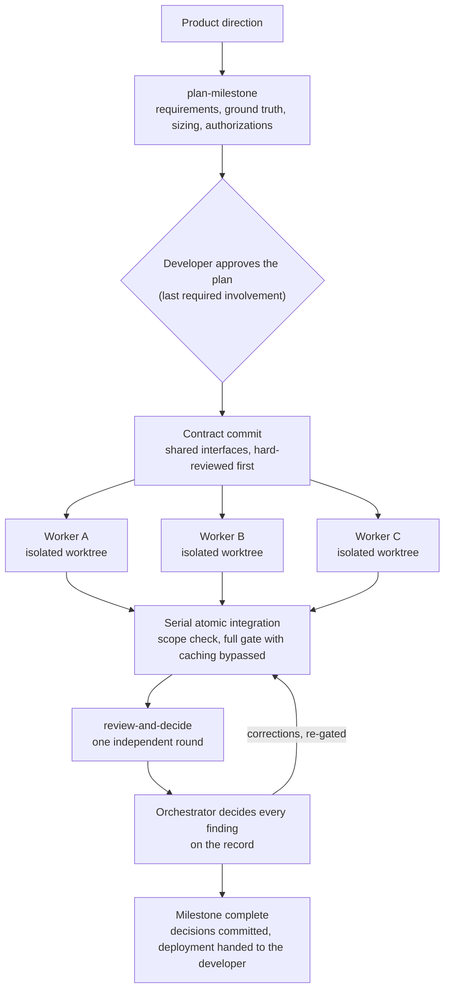

# Parallel Slices

[](https://github.com/jtrefry/parallel-slices/actions/workflows/quality.yml)

**Plan the product. Build it in parallel slices.**

Parallel Slices is four portable agent skills. Three take a product milestone
from an approved plan to a finished, independently reviewed result, with the
developer involved exactly twice: approving the plan and receiving the
outcome. The fourth keeps the delivery pipeline's supply chain gated using
the scanning tools' own mechanisms. They install into any repository for
Claude Code, Cursor, and Codex.

[Website](https://parallelslices.com) ·
[GitHub](https://github.com/jtrefry/parallel-slices)

> **Status:** version 2 is a ground-up replacement of the version 1 control
> plane. What used to be a 13,000-line orchestration state machine is now
> a small set of skills, two small scripts, and an installer. The reasons are in
> [Why version 2](#why-version-2) and the [changelog](CHANGELOG.md); the v1
> implementation remains in git history before 2.0.0.


## The skills

| Skill                                                        | What it does                                                                                                                                                                                                           |
| ------------------------------------------------------------ | ---------------------------------------------------------------------------------------------------------------------------------------------------------------------------------------------------------------------- |
| [`plan-milestone`](skills/plan-milestone/SKILL.md)           | Plan work so it runs to completion autonomously: requirements with observable evidence, committed ground truth, process sizing, and every authorization collected before work begins.                                  |
| [`build-parallel`](skills/build-parallel/SKILL.md)           | Execute the plan with parallel workers in isolated git worktrees: shared contracts first, one fresh agent per workstream, serial atomic integration.                                                                   |
| [`review-and-decide`](skills/review-and-decide/SKILL.md)     | One round of independent review by fresh agents, then the orchestrator decides every finding on the record. Reviews inform; they never veto.                                                                           |
| [`secure-supply-chain`](skills/secure-supply-chain/SKILL.md) | Gate dependency and image vulnerabilities with each tool's native mechanisms: production-only runtime images, report-then-gate scans at pull request, deploy, and on a schedule, one scoped suppression list per tool. |

Each skill bundles its own templates and scripts (worker packets, review
prompts, a ground-truth template, a scope checker, a worktree helper, an
image-scan job, a suppression policy) in a `files/` directory beside it.

New to CI, CD, or software quality? Plain-language guides to every skill,
written for readers who build with an agent and are learning the
fundamentals, start at [`docs/skills/`](docs/skills/README.md). Each guide
explains the skill's features, the decisions behind them, why those
decisions were made, and the tools involved.

## Install

```bash
node scripts/install-skills.mjs /path/to/project
node scripts/install-skills.mjs /path/to/project --tools claude,cursor
```

Claude Code reads `.claude/skills/<name>/SKILL.md` natively, including
automatic invocation from the description. Cursor gets `.cursor/commands/`
entries and Codex gets `.agents/skills/` pointers plus a marker-delimited
index block in `AGENTS.md`, all pointing at that same canonical copy.
Re-running the installer refreshes everything in place.

## Choosing the reviewer model

By default, reviewers run as fresh agents inside whatever tool is driving the
work, on whatever model that tool is using. That is the weakest form of the
idea. Two reviewers on the same model share its blind spots, so the second one
largely agrees with the first, and independent review stops being independent.
For work that matters, point the reviewer at a peer-capability model from a
different provider.

Name the invocation in **your project's own `AGENTS.md`**. Every tool these
skills install into already reads that file, and the installer only ever
replaces its own marker-delimited block, so your text survives re-installs.

```markdown
## Review policy

Run reviewers with: `codex exec --model gpt-5.6 "$(cat)"`
```

The contract is deliberately small: the orchestrator runs your command once per
reviewer, passes the review prompt on standard input, and reads the verdict,
summary, and findings from standard output. Reviewers never write, so the
command needs no write access and no sandbox exception. Name no invocation and
nothing changes.

**These skills are instructions, not code.** Nothing here reads an environment
variable, holds a credential, or talks to any API. The command you name is run
by your agent's ordinary shell tool, and it authenticates exactly as it does
when you type it in a terminal yourself. So the setup below is just "sign each
CLI in once, the way you already would", and everything about plans, keys, and
limits is that CLI's business rather than this project's.

### Reviewers run on the subscription you already have

**Use a subscription wherever you have one.** For agentic work, which is
token-heavy by construction, every provider's flat-rate plan is cheaper than
its metered API by orders of magnitude, not percentages. A review pass that is
a rounding error against a monthly plan is a real line item against a per-token
bill, and reviewers read the whole diff plus the surrounding code every time.

That is also what makes cross-provider review practical rather than a luxury.
If you already hold plans with two vendors, running the reviewer on the one
that did not build the work costs nothing extra per review. The independence
that makes a second reviewer worth having turns out to be the cheap option, not
the expensive one.

It helps on rate limits too. Plans meter the tool as a whole, so a reviewer on
a different plan than the builder is not competing for the builder's budget.

Signing each CLI in once is the whole setup.

| Provider  | Sign in once                                   | Reviewer command                             |
| --------- | ---------------------------------------------- | -------------------------------------------- |
| Anthropic | run `claude`, log in with a Pro or Max account | `claude -p "$(cat)" --model opus`            |
| OpenAI    | `codex login`                                  | `codex exec --model gpt-5.6-terra "$(cat)"`  |
| Google    | run `gemini`, choose "Sign in with Google"     | `gemini -m gemini-3-pro-preview -p "$(cat)"` |
| Cursor    | run `agent` and complete its first-run sign-in | `agent -p "$(cat)"`                          |

Model identifiers move faster than anything else here, and each vendor has its
own way to list what your account can actually serve: `claude --model` accepts
the aliases `opus`, `sonnet`, `haiku`, and `fable` as well as full names, so an
alias survives version changes; `codex debug models` prints the Codex catalog;
Gemini names are in the CLI's own model configuration.

Free-tier note: Gemini's personal Google account tier is 60 requests per minute
and 1,000 per day, which is ample for review. Codex usage under a ChatGPT
sign-in follows your ChatGPT plan's entitlements rather than per-token API
billing.

### Three things that will bite you

A reviewer command runs as a child of your agent and inherits its environment.
None of this is specific to these skills; it is how those CLIs behave.

- **In `-p` mode, an exported `ANTHROPIC_API_KEY` is always used, with no
  prompt.** Interactive Claude Code asks you once whether to accept a key it
  finds; non-interactive mode never asks. So a key you keep around for other
  work will silently bill API rates for every review your plan already covers.
  `unset ANTHROPIC_API_KEY` for the reviewer command. Anthropic's documented
  precedence puts `ANTHROPIC_AUTH_TOKEN` above `ANTHROPIC_API_KEY`, both above
  `CLAUDE_CODE_OAUTH_TOKEN`, and subscription login last.
- **`claude --bare` does not use your subscription at all.** Bare mode never
  reads OAuth credentials or the keychain and ignores `CLAUDE_CODE_OAUTH_TOKEN`;
  it needs `ANTHROPIC_API_KEY`. Anthropic recommends it for scripted calls and
  says it will become the default for `-p` in a future release, so a reviewer
  command that works on a subscription today may start demanding a key later.
  Pin the behavior you want rather than relying on the default.
- **Do not set provider API keys as job-level environment variables in CI that
  runs repository-controlled code.** This is OpenAI's own warning about
  `OPENAI_API_KEY` and `CODEX_API_KEY`, and it generalizes: a reviewer runs
  against a diff, and a diff can contain anything.

For CI or any machine without a browser, `claude setup-token` mints a one-year
OAuth token for `CLAUDE_CODE_OAUTH_TOKEN` that authenticates against your
subscription; Codex accepts `CODEX_API_KEY` as a single-run override.

### Other providers

OpenCode reaches 75+ providers and Aider is model-agnostic through LiteLLM;
either can serve as the reviewer command. Their flags are not reproduced here
because they were not verified against primary sources at the time of writing.
Check each tool's own documentation and confirm with the smoke test below.

To keep Claude Code as the harness while swapping the model underneath it,
point it at a gateway. `ANTHROPIC_BASE_URL` redirects the endpoint and
`ANTHROPIC_AUTH_TOKEN` is the documented variable for gateways that
authenticate with bearer tokens. The variables scope to that one child process,
so the orchestrator stays where it is:

```bash
env ANTHROPIC_BASE_URL=https://your-gateway.example \
    ANTHROPIC_AUTH_TOKEN="$GATEWAY_TOKEN" \
    claude -p "$(cat)"
```

This suits reviewers specifically because they are read-only: the whole tool
surface is reading, globbing, and grepping, and tool translation is where
gateways are least reliable. Note that a gateway is metered even if you hold a
Claude subscription, because the request never reaches Anthropic.

### Cursor, and running more than one model

Cursor has three separate paths, and they are worth keeping straight.

**The orchestrator's own model** is whatever you select in Cursor. Adding your
own provider keys under **Settings → Models** (OpenAI, Anthropic, Google, xAI)
lets you drive the work with one vendor's frontier model.

**The reviewers** do not have to run in Cursor at all, and this is the reliable
path to more than one model. Cursor's agent can run terminal commands, so it
honors exactly the same `AGENTS.md` invocation as every other tool. To get two
reviewers on two different providers, name both:

```markdown
## Review policy

Run the first reviewer with: `codex exec --model gpt-5.6 "$(cat)"`
Run the second reviewer with: `gemini -m gemini-3.1-pro -p "$(cat)"`
```

Neither reviewer shares a provider with the other or with Cursor, which is the
whole point.

**Cursor's own CLI** can also serve as a reviewer:

```bash
agent -p "$(cat)"
```

One caveat: Cursor's published CLI documentation covers `-p`,
`--output-format`, and `--force`, but documents no model-selection flag for
headless runs. If you need the reviewer's model pinned and auditable, use one
of the provider CLIs above instead, and check `agent --help` on your installed
version before relying on any flag here.

Two further notes on Cursor: it receives a thin `.cursor/commands/` adapter
rather than native skill invocation, so you invoke the skill deliberately; and
if agent terminal access is disabled, no configuration reaches the reviewers
and you get the single-tool default.

### Verify before you rely on it

CLI flags move. Confirm the invocation runs and returns findings on standard
output before trusting it in a real review:

```bash
echo "Reply with the word READY and nothing else." | <your reviewer command>
```

Every command in this section was checked against the vendor's own
documentation or source rather than a summary, but flags and model names change
without notice. The smoke test above is the only claim here that cannot go
stale.

## The flow



## Why version 2

Version 1 enforced this method with a large control plane: manifests, run
state, commit-kind gates, phase machines, and multi-round multi-agent review.
A full field trial ported a real application with it, end to end, and the
results split cleanly.

The method worked. Independent review caught defects no quality gate could
have: wire field names invented instead of read from the producing source
(every test stayed green because the fixtures agreed with the mistake), a
transform silently destroying byte-exact parity values, a container that
validated its configuration but never ran the validator, a 71-second
regular-expression hang. Isolated worktrees ran three workers concurrently
without a collision. Ground-truth documents and workers that verify premises
caught wrong assumptions before they became code.

The machinery failed. Eighteen control-plane defects blocked the run, each a
feature not threaded through its readers. The choreography amplified small
orchestrator mistakes into lost review rounds and stranded work, and its
fixed cost per slice exceeded the work itself on anything small. Review
rounds found new material in each other's corrections and never converged.

Version 2 keeps everything that produced quality and deletes everything that
produced downtime. Every rule in the skills traces to a measured failure; the
receipts are printed at the bottom of each skill.

## Develop Parallel Slices

```bash
npm ci
npm run check   # syntax, lint, format, tests
```

The canonical skills live in [`skills/`](skills/), the installer in
[`scripts/install-skills.mjs`](scripts/install-skills.mjs), and the tests in
[`tests/`](tests/). Contributions should preserve the shape: skills carry
judgment and procedure, scripts stay small and single-purpose, and anything
that starts to look like a state machine belongs in the tools themselves, not
here.
