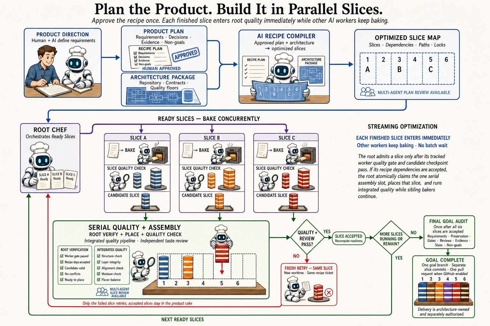
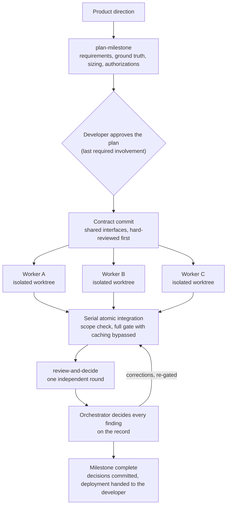

# Parallel Slices

[](https://github.com/jtrefry/parallel-slices/actions/workflows/quality.yml)

**Plan the product. Build it in parallel slices.**

Parallel Slices is four portable agent skills. Three take a product milestone
from an approved plan to a finished, independently reviewed result, with the
developer involved exactly twice: approving the plan and receiving the
outcome. The fourth keeps the delivery pipeline's supply chain gated using
the scanning tools' own mechanisms. They install into any repository for
Claude Code, Cursor, and Codex.

[Website](https://parallelslices.com) ·
[GitHub](https://github.com/jtrefry/parallel-slices)

> **Status:** version 2 is a ground-up replacement of the version 1 control
> plane. What used to be a 13,000-line orchestration state machine is now
> a small set of skills, two small scripts, and an installer. The reasons are in
> [Why version 2](#why-version-2) and the [changelog](CHANGELOG.md); the v1
> implementation remains in git history before 2.0.0.



## The skills

| Skill                                                        | What it does                                                                                                                                                                                                           |
| ------------------------------------------------------------ | ---------------------------------------------------------------------------------------------------------------------------------------------------------------------------------------------------------------------- |
| [`plan-milestone`](skills/plan-milestone/SKILL.md)           | Plan work so it runs to completion autonomously: requirements with observable evidence, committed ground truth, process sizing, and every authorization collected before work begins.                                  |
| [`build-parallel`](skills/build-parallel/SKILL.md)           | Execute the plan with parallel workers in isolated git worktrees: shared contracts first, one fresh agent per workstream, serial atomic integration.                                                                   |
| [`review-and-decide`](skills/review-and-decide/SKILL.md)     | One round of independent review by fresh agents, then the orchestrator decides every finding on the record. Reviews inform; they never veto.                                                                           |
| [`secure-supply-chain`](skills/secure-supply-chain/SKILL.md) | Gate dependency and image vulnerabilities with each tool's native mechanisms: production-only runtime images, report-then-gate scans at pull request, deploy, and on a schedule, one scoped suppression list per tool. |

Each skill bundles its own templates and scripts (worker packets, review
prompts, a ground-truth template, a scope checker, a worktree helper, an
image-scan job, a suppression policy) in a `files/` directory beside it.

## Install

```bash
node scripts/install-skills.mjs /path/to/project
node scripts/install-skills.mjs /path/to/project --tools claude,cursor
```

Claude Code reads `.claude/skills/<name>/SKILL.md` natively, including
automatic invocation from the description. Cursor gets `.cursor/commands/`
entries and Codex gets `.agents/skills/` pointers plus a marker-delimited
index block in `AGENTS.md`, all pointing at that same canonical copy.
Re-running the installer refreshes everything in place.

## The flow



## Why version 2

Version 1 enforced this method with a large control plane: manifests, run
state, commit-kind gates, phase machines, and multi-round multi-agent review.
A full field trial ported a real application with it, end to end, and the
results split cleanly.

The method worked. Independent review caught defects no quality gate could
have: wire field names invented instead of read from the producing source
(every test stayed green because the fixtures agreed with the mistake), a
transform silently destroying byte-exact parity values, a container that
validated its configuration but never ran the validator, a 71-second
regular-expression hang. Isolated worktrees ran three workers concurrently
without a collision. Ground-truth documents and workers that verify premises
caught wrong assumptions before they became code.

The machinery failed. Eighteen control-plane defects blocked the run, each a
feature not threaded through its readers. The choreography amplified small
orchestrator mistakes into lost review rounds and stranded work, and its
fixed cost per slice exceeded the work itself on anything small. Review
rounds found new material in each other's corrections and never converged.

Version 2 keeps everything that produced quality and deletes everything that
produced downtime. Every rule in the skills traces to a measured failure; the
receipts are printed at the bottom of each skill.

## Develop Parallel Slices

```bash
npm ci
npm run check   # syntax, lint, format, tests
```

The canonical skills live in [`skills/`](skills/), the installer in
[`scripts/install-skills.mjs`](scripts/install-skills.mjs), and the tests in
[`tests/`](tests/). Contributions should preserve the shape: skills carry
judgment and procedure, scripts stay small and single-purpose, and anything
that starts to look like a state machine belongs in the tools themselves, not
here.
