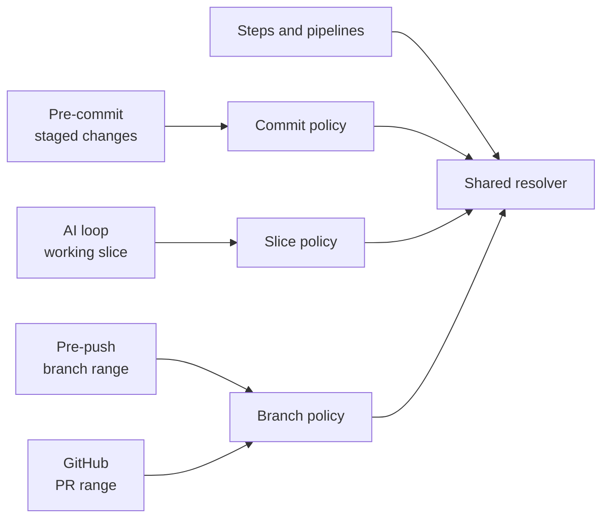

# Configurable compilation and quality pipelines

Generated repositories keep quality configuration in
`.parallel-slices/config.json`. Its local JSON Schema provides editor completion
and documents the installed format. The file selects the slice-sizing policy
used during AI compilation and supplies the same step and pipeline definitions
to slice gates, Husky hooks, the project doctor, and the GitHub Quality
workflow.

The installed format is `version: 5`. Update the configuration, schema, runtime,
tests, and documentation together when changing that contract.

When upgrading a version 4 installation, add the architecture-appropriate
`sliceCompilation` object. The bundled `nextjs-gcp-postgres` package defaults to
`throughput-balanced`.

When upgrading a version 3 installation, remove step `required` fields,
pipeline `requiredCapabilities` and `requiresExplicitFlag` fields, and the
`gitHooks` object. Add the schema reference and five `entrypoints` shown below.
The former `ci` pipeline alias can be removed when the `ci` entry point maps
directly to `full`. Also add `sliceCompilation` as described above. Run
`quality.mjs validate` before using the new hooks.

## Slice-compilation policy

Architecture packages install a default that a project may override before
Product Plan approval:

```json
{
  "sliceCompilation": {
    "sizingStrategy": "throughput-balanced"
  }
}
```

Use `isolation-first` for the smallest coherent, independently verifiable
vertical outcomes. Use `throughput-balanced` to combine compatible small
outcomes when another full candidate pipeline, integrated pipeline, review,
evidence record, and commit would cost more than the split gains through
concurrency, earlier prerequisite release, or retry isolation.

This setting never changes quality steps, scope enforcement, resource locks,
review, exclusive serial integration, or final auditing. AI records the
effective policy, dependency rationale, parallelism evidence, and concrete
sizing rationale in compiled version 5 run state.
It is a compile-time partitioning policy, not a runtime auto-tuner: the current
implementation uses committed project evidence when available and otherwise
applies the architecture-guided rubric. It never resizes an execution map after
that map is committed.

Inspect the reproducible inputs from the repository root with:

```bash
node scripts/parallel-slices/slice-compilation.mjs snapshot
```

## Two enforcement layers

The system deliberately separates configurable quality checks from fixed
safety policy:

1. **Quality pipelines** run package scripts for linting, formatting, types,
   tests, builds, and security scanners.
2. **Lifecycle policy** validates the branch, project stage, change range,
   committed scope contracts, release notes, and potential secrets.

JSON may select and extend quality pipelines. It cannot disable lifecycle
policy or execute arbitrary shell commands.

Multi-agent review is a third, separate layer configured in
`.parallel-slices/review.json`. It runs only after the manifest-selected loop gate,
uses provider CLIs instead of package scripts, and writes
permanent review artifacts. It cannot replace a pipeline capability or weaken
fixed lifecycle policy. Validate its configuration without provider calls by
running, from the generated repository root,
`node scripts/parallel-slices/review.mjs validate`. Each reviewed manifest owns
exact JSON and Markdown paths under `docs/plans/reviews/`. See the installed
`docs/parallel-slices/multi-agent-review.md`.

Every lifecycle context resolves its pipeline through the same shared resolver,
so the loop, hooks, and CI cannot drift apart:



| Entry point         | Change range                     | Fixed policy                                                              | Default pipeline     |
| ------------------- | -------------------------------- | ------------------------------------------------------------------------- | -------------------- |
| `generatedBaseline` | complete attested generated tree | exact paths, SHA-256 hashes, executable bits, architecture, stage, branch | `generated-baseline` |
| `preCommit`         | Git index                        | branch, stage, staged-secret scan                                         | `core`               |
| `loop`              | current slice worktree           | committed scope, allowed paths, release notes, secrets                    | scope manifest       |
| `prePush`           | merge base through `HEAD`        | branch-wide scope coverage, release notes, secrets                        | `full`               |
| `ci`                | pull-request range               | same branch policy as pre-push                                            | `full`               |

New compiled manifests also carry per-slice `coverage` records for entry
points, contracts, consumers, data side effects, tests, and operations. That
compile-time impact evidence explains why the worker scope is sufficient; it is
distinct from the branch-wide changed-path coverage enforced by pre-push and
CI.

Pre-push and pull-request CI validate committed branch content. Every changed
path must be covered by a new scope manifest on the branch. Existing scope
manifests are immutable. Each slice classified `release_notes=developer` must
have an allowed developer fragment. Automation branches recognized by
`branchPolicy` retain the secret scan and full quality pipeline but do not
require AI-authored plan or release-note artifacts. The protected-branch
post-merge run also repeats the secret scan and full pipeline without
reconstructing source-branch scope; the required pull-request check is the
server-side scope boundary.

## Step registry

Every step invokes the first matching root package script:

The following SQL step and composition are from the bundled `postgres`
profile. The `external-api-only` profile omits this step from its registry,
pipelines, and capability floors.

```json
{
  "steps": {
    "sql-security": {
      "name": "SQL security scan",
      "runner": "package-script",
      "scripts": ["security:sql"],
      "timeoutSeconds": 300,
      "provides": ["security:sql"]
    }
  }
}
```

Referenced steps are always required. A missing script fails before partial
pipeline execution. Unreferenced registry entries do not block the project
doctor, which inspects only steps reachable from configured lifecycle entry
points. Script names, capabilities, timeouts, IDs, inheritance, and duplicate
membership are validated before execution.

## Pipeline composition

A pipeline owns a complete ordered step list or extends one pipeline and
appends steps:

```json
{
  "pipelines": {
    "core": {
      "steps": ["format", "lint", "types", "sql-security", "build", "unit"]
    },
    "full": {
      "extends": "core",
      "append": ["integration", "e2e", "trivy"]
    }
  }
}
```

The runtime derives capabilities from the resolved required steps. Fixed
capability floors prevent lifecycle mappings from being weakened:

- `generatedBaseline` must provide the architecture's checks for its unchanged
  starter artifact; the bundled package requires lint, types, and build.
- `preCommit` and manifest-selected loop pipelines must provide format, lint,
  types, SQL security, build, and unit capabilities.
- `prePush` and `ci` must also provide integration, E2E, and Trivy.

A project may replace a tool as long as the replacement step provides the same
capability. It may define any number of specialized pipelines. The names
`core` and `full` are defaults, not hard-coded runtime requirements.

## Lifecycle entry points

Entry points map lifecycle contexts to pipelines once:

```json
{
  "entrypoints": {
    "generatedBaseline": { "pipeline": "generated-baseline" },
    "preCommit": { "pipeline": "core" },
    "prePush": { "pipeline": "full" },
    "ci": { "pipeline": "full" },
    "loop": { "pipelineFrom": "scopeManifest" }
  }
}
```

`generatedBaseline` is selected automatically only while project state remains
`initialization-required` and the complete working tree matches
`.parallel-slices/generated-baseline.json`. It is not a general lightweight
project gate. A missing, unexpected, modified, symlinked, or executable-bit
changed file refuses the path and directs the project through initialization.

Do not add per-step hook booleans. They create a second membership and ordering
system that can conflict with pipeline composition.

The installed commands are, from the generated repository root:

```bash
node scripts/parallel-slices/quality.mjs entrypoint preCommit
node scripts/parallel-slices/quality.mjs entrypoint prePush --base origin/main
node scripts/parallel-slices/quality.mjs entrypoint ci --base origin/main --branch feature/example
```

Husky supplies the Git remote to pre-push automatically. GitHub Actions supplies
the checked-out branch and base commit through its trusted event payload; the
runner rejects conflicting command-line values. A local manual pre-push run
must provide `--base` when the remote default branch cannot be resolved.

Run a manifest-selected slice gate from the generated repository root:

```bash
node scripts/parallel-slices/gate.mjs \
  --scope-file docs/plans/scopes/<feature>/<slice>.scope
```

Running `quality.mjs pipeline <name>` executes quality checks only. It is useful
for diagnostics but is not a replacement for a policy-aware lifecycle entry
point.

## Inspect and validate configuration

Validate the complete v5 contract without running checks. From the generated
repository root:

```bash
node scripts/parallel-slices/quality.mjs validate
```

Resolve an entry point or pipeline and show selected scripts, order, timeouts,
capabilities, and missing prerequisites. From the generated repository root:

```bash
node scripts/parallel-slices/quality.mjs explain prePush
node scripts/parallel-slices/quality.mjs explain full --json
```

The schema path is `.parallel-slices/config.schema.json`. Keep
`"$schema": "./config.schema.json"` in the configuration for editor support.

## Add a project-specific scanner

First add a deterministic, non-watch root package script:

```json
{
  "scripts": {
    "security:licenses": "node scripts/security/license-policy.mjs"
  }
}
```

Register the step and append it to a pipeline:

```json
{
  "steps": {
    "license-policy": {
      "name": "license policy",
      "runner": "package-script",
      "scripts": ["security:licenses"],
      "timeoutSeconds": 120,
      "provides": ["security:licenses"]
    }
  },
  "pipelines": {
    "full": {
      "extends": "core",
      "append": ["integration", "e2e", "trivy", "license-policy"]
    }
  }
}
```

JSON does not merge fragments. Preserve existing sibling keys when editing the
installed file.

To add a database-specific branch gate without changing the default pipeline:

```json
{
  "pipelines": {
    "database-change": {
      "extends": "full",
      "append": ["migration-integration"]
    }
  },
  "entrypoints": {
    "prePush": { "pipeline": "database-change" }
  }
}
```

Preserve all five entry points in the real file. Record why a required tool or
capability is replaced in the project's decision log. Never weaken a gate to
make a failing change pass.
