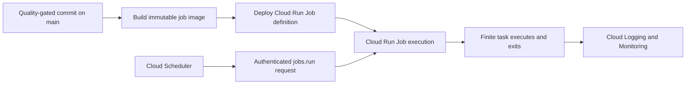

# GCP delivery baseline

This page describes the complete `postgres` profile. The
`external-api-only` profile retains Artifact Registry, Cloud Run, Workload
Identity Federation, and immutable-image delivery but omits Cloud SQL,
`DATABASE_URL`, and database-migration requirements.

The deployment baseline is deliberately narrow:

- Web services and APIs run as Cloud Run services.
- PostgreSQL runs in Cloud SQL for PostgreSQL.
- Secrets come from Secret Manager.
- Container images are stored in Artifact Registry and identified by commit
  SHA, not a mutable `latest` tag.
- Scheduled and finite background work runs as Cloud Run Jobs.
- Cloud Scheduler invokes scheduled Cloud Run Jobs.
- Cloud Functions are not a deployment target for this template.

The implementation loop never deploys, schedules jobs, or runs production
database migrations. Those actions belong to reviewed GitHub environments and
separately authorized delivery workflows.

## Installed service deployment workflow

`.github/workflows/deploy-cloud-run.yml` waits for the `Quality` workflow to
succeed on `main`, then builds an immutable container, pushes it to Artifact
Registry, and deploys the same image to Cloud Run. It also supports a manual run
from `main`. BuildKit publishes maximum-mode provenance and a software bill of
materials with the image.

The deployment job remains skipped until all required repository variables are
configured:

| Variable                      | Purpose                                                       |
| ----------------------------- | ------------------------------------------------------------- |
| `GCP_PROJECT_ID`              | GCP project containing the runtime                            |
| `GCP_REGION`                  | Cloud Run, Artifact Registry, and preferably Cloud SQL region |
| `GCP_ARTIFACT_REPOSITORY`     | Existing Docker repository in Artifact Registry               |
| `GCP_IMAGE_NAME`              | Service container image name                                  |
| `GCP_CLOUD_RUN_SERVICE`       | Cloud Run service name                                        |
| `GCP_WIF_PROVIDER`            | Workload Identity Federation provider resource name           |
| `GCP_DEPLOY_SERVICE_ACCOUNT`  | GitHub deployment service account                             |
| `GCP_RUNTIME_SERVICE_ACCOUNT` | Least-privilege Cloud Run runtime identity                    |
| `GCP_CLOUD_SQL_INSTANCE`      | Cloud SQL connection name: `project:region:instance`          |
| `GCP_DATABASE_URL_SECRET`     | Secret Manager secret containing `DATABASE_URL`               |
| `DOCKER_CONTEXT`              | Optional Docker build context, defaults to `.`                |
| `DOCKERFILE`                  | Optional Dockerfile path, defaults to `Dockerfile`            |

Create a protected GitHub environment named `production`. Require reviewers when
the project's release policy calls for manual approval. Use Workload Identity
Federation rather than storing a service-account key in GitHub.

The registry authentication step does not create a credential file in the
workspace before the Docker build. Deployment authentication occurs only after
the image has been built. Also ignore `gha-creds-*.json` in `.gitignore` and
`.dockerignore` as defense in depth whenever Google authentication is used. The
generic [`cloud-run.dockerignore`](../examples/cloud-run.dockerignore) is a
starting point; review it against the actual Docker build context.

The workflow does not change public access policy. Configure Cloud Run IAM
separately so a deployment cannot accidentally make a private service public or
a public service private.

## PostgreSQL and migrations

Place Cloud SQL in the same region as Cloud Run unless a documented resilience
design requires otherwise. Grant the runtime service account only the Cloud SQL
Client and application-specific roles it needs. Store credentials in Secret
Manager and bound the application's connection pool: Cloud Run scaling can
otherwise multiply PostgreSQL connections quickly.

Do not run schema migrations during application startup. Use an explicitly
invoked, single-task Cloud Run Job with a dedicated migration command and
service account. The deployment plan must define ordering, compatibility,
backup, rollback, idempotency, and failure handling before a migration workflow
is enabled. A failed migration must prevent promotion of code that depends on
the new schema.

Generated projects start with timestamped migration files in
`apps/backend/migrations/` and the explicit
`scripts/database/postgres-migration-runner.ts` command. The runner serializes
execution with an advisory lock, rejects modified or missing applied files, and
records checksums transactionally. Treat it as the default contract and record
any approved replacement in the architecture decision log.

[`examples/github-actions-run-postgres-migration-job.yml`](../examples/github-actions-run-postgres-migration-job.yml)
executes an existing migration job from the protected `production` environment
and waits for success. It is manual by design; integrate it into automated
delivery only after the project's expand/contract policy makes the ordering
safe.

## Scheduled jobs

Use [`examples/github-actions-deploy-cloud-run-job.yml`](../examples/github-actions-deploy-cloud-run-job.yml)
as a starting point for each job image and
[`examples/gcp-scheduled-cloud-run-job.tf`](../examples/gcp-scheduled-cloud-run-job.tf)
to connect an existing Cloud Run Job to Cloud Scheduler.

The example constrains Terraform and the Google provider. In an initialized
project, run `terraform init`, review the selected provider, and commit the
generated `.terraform.lock.hcl` so CI and operators use the reviewed provider
build and checksums.

Duplicate and rename the workflow per job rather than making one workflow accept
arbitrary production commands. Define the container entrypoint in code, keep
tasks finite and retry-safe, and configure timeouts and concurrency for the
workload.

Scheduled execution follows this path:

Never replace this path with a Cloud Function. Cloud Run Jobs are designed for
finite tasks that run to completion, and Cloud Scheduler provides the cron
trigger.

## Before enabling delivery

- Review and pin third-party GitHub Actions according to the repository's
  supply-chain policy.
- Create Artifact Registry, Cloud Run, Cloud SQL, Secret Manager, WIF, and
  service accounts through reviewed infrastructure as code.
- Grant deployment and runtime identities separately with least privilege.
- Confirm the container listens on Cloud Run's `PORT` and shuts down cleanly.
- Add a production, monorepo-aware Dockerfile and reviewed `.dockerignore`.
- Add a post-deployment health or smoke check appropriate to the service.
- Define monitoring, rollback, traffic migration, and incident ownership.
- Confirm database backups and recovery before enabling schema migrations.
