# Generated application baseline

The `nextjs-gcp-postgres` architecture package combines a reproducible Turborepo
generator with an exact application baseline. It does not run
`create-next-app@latest` during
each project creation. Resolving `latest` at invocation time would make two
bootstrap runs produce different dependency graphs without any intervening
dependency review.

## Source of truth

[`architectures/nextjs-gcp-postgres/scaffold/package.json`](../architectures/nextjs-gcp-postgres/scaffold/package.json)
pins the versions used in a new project.
[`architectures/nextjs-gcp-postgres/scaffold/templates/`](../architectures/nextjs-gcp-postgres/scaffold/templates/)
owns the App Router
layout, starter page, global CSS, PostCSS configuration, shared UI exports, and
the generated root README. Dependency automation reviews the scaffold manifest
weekly.

The baseline currently establishes:

- exact versions for every external direct dependency inherited from the pinned
  generator, so an upstream template cannot silently introduce an unreviewed
  package or range;
- exact Next.js, React, React DOM, and matching React type versions;
- exact Mantine Core and Hooks versions;
- a Cursor Agent CLI review profile for independent subscription review turns,
  with no project SDK dependency;
- exact npm, pnpm, Yarn, and Bun versions selected by fresh generation;
- a `.node-version` pin for Node.js 24 plus a root engine range limited to the
  supported Node.js 22 and 24 LTS lines;
- a package-manager-neutral PostCSS override for the patched baseline version;
- Mantine's core stylesheet, `MantineProvider`, `ColorSchemeScript`, and
  `mantineHtmlProps` for server-rendered color schemes;
- Mantine's PostCSS preset and breakpoint variables;
- Mantine-backed exports in the starter shared UI package; and
- no Tailwind package, directive, or configuration;
- package-manager-specific install and run commands in the root README;
- direct links from the generated README to the canonical public workflow and
  mechanism documentation instead of a copied lifecycle explanation; and
- removal of the upstream `apps/docs/` Next.js application so `apps/web/` is
  the only starter application and root `docs/` is unambiguously the
  documentation tree; and
- `.parallel-slices/generated-baseline.json`, a sorted SHA-256 and executable-bit
  attestation of the complete generated file set.

Mantine's official Next.js guide requires the provider, color-scheme script,
HTML props, and core stylesheet used here. The official setup is documented at
<https://mantine.dev/guides/next/>.

## Generation sequence

```mermaid
flowchart LR
    A["Pinned create-turbo"] --> B["Uninstalled temporary monorepo"]
    B --> C["Remove upstream apps/docs application"]
    C --> D["Apply exact Next.js, Mantine, and README baseline"]
    D --> E["Remove and prohibit Tailwind"]
    E --> F["Install once and create lockfile"]
    F --> G["Install Parallel Slices controls"]
    G --> H["Attest complete generated tree"]
    H --> I["Verify scaffold and attestation"]
    I --> J["Atomically publish destination"]
```



For `nextjs-gcp-postgres`, valid package managers are `pnpm`, `npm`, `yarn`,
and `bun`; valid profiles are `postgres` and `external-api-only`. A creation
configuration cannot be combined with direct architecture or controller flags,
preventing two competing sources of truth. For compatibility, the equivalent
direct command remains available. From the Parallel Slices checkout root:

```bash
npm run bootstrap -- \
  --architecture nextjs-gcp-postgres \
  --profile external-api-only \
  --package-manager pnpm \
  --default-controller cursor \
  /absolute/path/to/my-product
```

The architecture package bootstrap:

1. stages a fresh pinned `create-turbo` project beside the destination without
   installing dependencies;
2. applies the exact Next.js, React, and Mantine baseline, removes Tailwind,
   removes the upstream `apps/docs/` application so `apps/web/` is the only
   starter application, replaces the upstream starter README with concise,
   package-manager-specific onboarding that links to the canonical Parallel
   Slices documentation, and creates `.parallel-slices/scaffold-profile.json`;
3. installs dependencies once with the selected package manager;
4. removes the scaffold's Git history and initializes
   `chore/initialize-project`;
5. installs the architecture-neutral controls plus the selected package base
   and profile overlays;
6. enables Cursor, Codex, and Claude Code and records one default controller;
7. installs only reviewed skills into all three native directories;
8. records a SHA-256 attestation of every generated file, activates Husky, and
   verifies the generated repository; and
9. atomically moves the project to the requested destination.

If any step fails, the destination is not created and staging data is removed.
The equivalent bare scaffold command, runnable from any directory with Node.js
available, is:

```bash
npx --yes create-turbo@2.10.5 /absolute/path/to/project \
  --package-manager npm \
  --skip-install \
  --no-git
```

That bare command creates only the upstream Turborepo scaffold. It does not
apply the reviewed Next.js baseline or Mantine configuration, and it omits the
agent, quality, security, release, and Google Cloud contracts that the
bootstrap installs.

The transformer writes `.parallel-slices/scaffold-profile.json` into the generated
repository. Verification then checks the selected `postgres` or
`external-api-only` data layer, the Cursor Agent CLI review profile, and
each listed Next.js application for exact framework and Mantine dependencies, required
root-layout integration, PostCSS configuration, and the absence of Tailwind. It
also checks that the generated README preserves Parallel Slices attribution,
canonical public documentation, version-matched controller links, and clone
prerequisites. Dependency, package-manager, documentation, security-override,
or UI drift fails before the temporary project is moved to its destination.

The generated project remains at `initialization-required`, so ordinary
product changes cannot use lifecycle gates. One narrow exception allows an
exactly attested generated tree to be committed, pushed, and checked with the
architecture's `generatedBaseline` pipeline. This includes a deterministic
maintenance refresh of an uninitialized generated repository: the refreshed
attestation must be staged, the complete resulting Git index must exactly match
the attested tree, and no tracked change may remain unstaged. The bundled
architecture requires lint, type-checking, and production builds there. The
attestation refuses a missing, unexpected, modified, symlinked, or
executable-bit-changed file. Once any project-specific edit is made, the
exception closes and the enabled controller must complete initialization and
the normal quality foundation.

Routine Dependabot version updates are dormant during this narrow state because
their edits cannot pass the pristine attestation and the full dependency-review
pipeline does not exist yet. Dependabot security updates remain eligible. The
architecture initialization workflow enables weekly npm and GitHub Actions
version updates after it installs the complete quality foundation; foundation
verification refuses to declare the project initialized while routine updates
remain dormant. GitHub documents this version-update-only pause in
[Disabling Dependabot version updates](https://docs.github.com/en/code-security/how-tos/secure-your-supply-chain/secure-your-dependencies/configure-version-updates#disabling-dependabot-version-updates).

## Updating the baseline

A maintainer updates exact versions in
`architectures/nextjs-gcp-postgres/scaffold/package.json`, then runs, from the
Parallel Slices checkout root:

```bash
npm ci
npm run check
npm run bootstrap -- --architecture nextjs-gcp-postgres \
  --default-controller cursor /tmp/parallel-slices-smoke
cd /tmp/parallel-slices-smoke
node scripts/parallel-slices/corepack-runner.mjs pnpm run build
node scripts/parallel-slices/generated-baseline.mjs
```

Use a disposable destination that does not already exist. Review framework,
toolchain, package-manager, and Action release notes; compatibility holds in the
scaffold manifest; generated lockfile changes; server rendering; hydration; and
the production build before accepting an update. Parallel Slices Dependabot
monitors both the scaffold manifest and the architecture workflow overlay. The
repository audit requires source monitoring to preserve every reviewed ignore
from the generated architecture policy. A newly published package is not the
reviewed baseline until these checks pass.

## Existing repositories

`scripts/setup.sh --architecture nextjs-gcp-postgres` installs the control layer into an
existing compatible Turborepo. It
does not run the scaffold transformer, create a scaffold profile, add Mantine,
or remove Tailwind. Adoption preserves the existing product's architecture and
requires any UI migration to be separately planned and approved.
