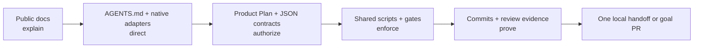

# How Parallel Slices works: mechanism map

The diagrams in the [Parallel Slices README](../README.md#understand-the-model)
show the product workflow. This guide explains the machinery behind those
diagrams: what each kind of file is, what authority it has, and how the pieces
cooperate from project generation through the final pull request.

For the exact Git and worktree transition at every pipeline stage, use the
[pipeline walkthrough](pipeline-walkthrough.md). For step-by-step operation of
a generated project, use the [operating guide](operating-guide.md).

## The short version

Parallel Slices separates five responsibilities that are often blurred together
in an AI coding workflow:

1. **Documentation explains** the model to people.
2. **Repository instructions and native skills direct** each AI tool into the
   same workflow.
3. **Plans and JSON contracts authorize** the exact product outcome and bounded
   execution graph.
4. **Dependency-light scripts enforce** scope, quality, review, Git, and state
   transitions.
5. **Commits and evidence prove** what was approved, checked, accepted, and
   completed.

No prompt or skill is the security boundary by itself. The durable contracts and
executable checks are what turn agent guidance into a controlled workflow.

## Read a generated repository by file type

| Mechanism                      | Kind                                                                         | Typical locations in a generated project                                                                                                                  | Purpose and authority                                                                                                                                                                                                                                |
| ------------------------------ | ---------------------------------------------------------------------------- | --------------------------------------------------------------------------------------------------------------------------------------------------------- | ---------------------------------------------------------------------------------------------------------------------------------------------------------------------------------------------------------------------------------------------------- |
| Public documentation           | Human explanation                                                            | The upstream `README.md` and `docs/` in the Parallel Slices project                                                                                       | Explains the model, diagrams, architecture, and operating choices. It is the canonical reader-facing source and does not authorize a run.                                                                                                            |
| Repository instructions        | Agent instructions                                                           | Root and nested `AGENTS.md`; `.claude/CLAUDE.md`; `.cursor/rules/`                                                                                        | Tell an agent how to behave in a repository or directory. Nested files add local rules. They guide decisions but do not replace executable validation.                                                                                               |
| Native adapters                | Skills, commands, and rules                                                  | `.agents/skills/`, `.cursor/commands/`, `.cursor/skills/`, `.cursor/rules/`, `.claude/skills/`                                                            | Expose initialization, planning, preparation, orchestration, and status in each tool's native format. They validate controller enablement and load shared procedures; they remain thin so policy does not drift by tool.                             |
| Installed operating contracts  | Version-matched Markdown procedures                                          | `docs/parallel-slices/`                                                                                                                                   | Give agents the exact planning, worker, root-controller, review, recovery, and publication procedures installed with that repository version. These are execution contracts, not a second set of public overview documentation.                      |
| Architecture selection         | Validated JSON                                                               | `.parallel-slices/architecture.json`                                                                                                                      | Records the immutable architecture package, source, package version, profile, manifest and package-content hashes, resolved options, required files, quality floors, and controller entry points. A different package or profile requires migration. |
| Generated baseline attestation | Generated JSON plus dependency-light verification code                       | `.parallel-slices/generated-baseline.json`, `scripts/parallel-slices/generated-baseline.mjs`                                                              | Hashes the complete fresh-project tree and executable bits. It permits only that pristine artifact to use the narrow starter-publication pipeline; any changed file requires normal initialization.                                                  |
| Project policy                 | Validated JSON                                                               | `.parallel-slices/config.json`, `agent.json`, `repository.json`, and `review.json`                                                                        | Selects quality pipelines, slice sizing, enabled controllers, publication authorization, and reviewer policy. Schemas beside these files reject malformed or weakened contracts.                                                                     |
| Product contract               | Human-approved Markdown                                                      | `docs/project/` and the active Product Plan under `docs/plans/`                                                                                           | Records requirements, decisions, preservation rules, architecture, security, testing, operations, evidence, risks, and non-goals. The Product Plan is the human approval surface.                                                                    |
| Compiled execution contract    | Scope manifests and JSON state                                               | `docs/plans/scopes/`, `docs/plans/loop-runs/`, and `.parallel-slices/project-state.json`                                                                  | Converts the approved plan into exact slices, dependencies, path ownership, resource locks, gates, commit subjects, and lifecycle state. These files may narrow execution but may not invent product scope.                                          |
| Enforcement runtime            | Dependency-light Node.js code                                                | `scripts/parallel-slices/`                                                                                                                                | Validates branches and profiles, compiles and validates slice graphs, creates worktrees, enforces scope, runs quality pipelines, manages leases and attempt ledgers, invokes review, records state, and reports status.                              |
| Local and CI gates             | Hooks, workflow YAML, and package scripts                                    | `.husky/`, `.github/workflows/quality.yml`, `.parallel-slices/config.json`, root `package.json`                                                           | Resolves each architecture-declared entry-point floor from the same project configuration before commits, before pushes, and in pull-request CI. Local hooks provide fast feedback; protected branches and required CI remain the security boundary. |
| Review evidence                | JSON plus generated Markdown                                                 | `docs/plans/reviews/`                                                                                                                                     | Records fingerprinted planning and integrated-slice review results. Provider failure, stale input, or malformed output is never converted into approval.                                                                                             |
| Recovery evidence              | Ignored runtime JSON                                                         | `.parallel-slices/runtime/`                                                                                                                               | Tracks leases, worktrees, attempts, worker gates, integrated gates, interruptions, and retries on the current machine. It is intentionally not committed; accepted slice commits remain the cross-machine recovery boundary.                         |
| Delivery evidence              | Markdown and Git history                                                     | `docs/releases/`, manual test scripts, slice commits, and the goal pull request                                                                           | Connects implementation to release impact, human evidence, accepted slices, and the final audited goal without deploying or merging automatically.                                                                                                   |
| Architecture-specific controls | Code, configuration, and workflows owned by the selected package and profile | For `nextjs-gcp-postgres`: profile-selected quality and Cloud Run workflows, optional database and migration tooling, Trivy config, and dependency policy | Enforces assumptions that do not belong in the core, such as Next.js, Mantine, external APIs or PostgreSQL, Docker, Trivy, and Google Cloud.                                                                                                         |
| Curated third-party skills     | Advisory skills with provenance                                              | Tool-native skill directories plus `THIRD_PARTY.md`                                                                                                       | Adds reviewed framework advice. Sources are commit-pinned and hash-verified. These skills never override repository rules, approved requirements, security policy, or the selected architecture.                                                     |

## Where the mechanisms come from

A generated repository is assembled from reviewed sources rather than from one
large template:

| Source in Parallel Slices                          | What it contributes                                                                                                                                                                 |
| -------------------------------------------------- | ----------------------------------------------------------------------------------------------------------------------------------------------------------------------------------- |
| `scripts/bootstrap-new.mjs`                        | Validates options, stages generation, initializes the safe branch, installs controls, attests the complete tree, activates hooks, verifies the result, and atomically publishes it. |
| `repo-overlay/`                                    | Architecture-neutral instructions, profiles, schemas, native adapters, procedures, plan templates, gates, review, recovery, and orchestration code installed into every project.    |
| `architectures/<id>/architecture.json`             | The versioned package identity, options, capabilities, quality floors, required installed files, verifier, project documents, and controller commands.                              |
| `architectures/<id>/generator.mjs` and `scaffold/` | The fresh application shape and reviewed dependency/UI baseline for that architecture.                                                                                              |
| `architectures/<id>/repo-overlay/`                 | Architecture-specific initialization, CI, delivery, data, security, and verification behavior.                                                                                      |
| `scripts/install.sh`, `setup.sh`, and `verify.sh`  | Fresh-project installation, existing-repository adoption, and target-side completeness checks.                                                                                      |

The architecture-neutral overlay and the selected architecture overlay are the
copy sources of truth. Their manifests and verifier lists are the installation
completeness contracts; generated repositories do not maintain a separate copy
allowlist.

## How the pieces cooperate through the workflow

| Workflow stage         | Human or agent-facing mechanism                           | Executable mechanism                                                                                     | Durable result                                                                                                         |
| ---------------------- | --------------------------------------------------------- | -------------------------------------------------------------------------------------------------------- | ---------------------------------------------------------------------------------------------------------------------- |
| Generate or adopt      | Bootstrap command and architecture documentation          | Generator, overlay installer, baseline attestation, package verifier, and Husky setup                    | Verified scaffold, immutable architecture selection, enabled controller profiles, and an initialization-required stage |
| Inspect and interview  | Architecture initialization skill plus root instructions  | Profile checks, Git safety checks, and project doctor                                                    | Recorded product answers, locked decisions, publication choice, and reviewer choice                                    |
| Write the Product Plan | Product-plan template and project-document instructions   | Contract validation and the initialization gate                                                          | Project-specific `AGENTS.md`, `docs/project/`, and a draft Product Plan                                                |
| Human approval         | The human-readable Product Plan                           | Branch, staged-secret, plan-boundary, and available quality checks                                       | One approved Product Plan commit and its full SHA                                                                      |
| Compile execution      | Shared planning procedure                                 | Slice compiler, graph validator, scope coverage checks, and read-only worker rehearsal                   | Separate committed manifests, dependency DAG, resource locks, Ready Slices, and versioned JSON state                   |
| Approve the map        | Native adapter invokes the shared multi-agent procedure   | Bounded provider runner, snapshot fingerprinting, and review verification                                | Separate committed planning-review JSON/Markdown pair; no worker can start without it                                  |
| Prepare a run          | Native prepare skill                                      | State, graph, branch, publication, and controller validation                                             | An exact reviewed `/loop` or `/goal` invocation                                                                        |
| Schedule work          | Continuing root-controller skill and procedure            | Lease, Ready Slice calculation, worktree creation, and attempt tracking                                  | One isolated worktree and fresh worker context per safe ready slice                                                    |
| Build a slice          | Worker instructions, Product Plan, and one scope manifest | Scope preflight, package-script quality pipeline, self-check, and candidate tracking                     | One clean detached candidate commit plus compact evidence                                                              |
| Integrate a slice      | Root-controller procedure                                 | Candidate verification, serialized apply, integrated gate, independent review, state update, and cleanup | One accepted goal-branch commit, permanent evidence, and recalculated readiness                                        |
| Recover                | Status skill and recovery procedure                       | Read-only status aggregation over committed state, runtime ledgers, Git, and worktrees                   | A safe resume, fresh retry, explicit recovery packet, or actionable stop                                               |
| Complete               | Final-audit procedure                                     | Requirement, preservation, gate, review, release, scope, and Git evidence checks                         | `MILESTONE_FINISHED` locally or one CI-green `PULL_REQUEST_READY`; never an automatic merge or deployment              |

This division is why ready slices can run concurrently without allowing
concurrent writes to the goal branch. Workers own bounded detached worktrees;
the root controller alone integrates one verified candidate at a time.

## Instructions are not enforcement

The most important boundary is between advice and proof:

- `AGENTS.md`, skills, commands, rules, and workflow Markdown tell an agent what
  to do.
- Schemas, manifests, configuration, and committed state define what the run is
  allowed to do.
- Runtime scripts, hooks, and CI test whether the proposed action stays inside
  that contract.
- Git commits, review ledgers, release fragments, and test results preserve the
  evidence needed for acceptance and recovery.

If an instruction says a slice owns one path but its manifest does not, the
manifest wins and the scope gate refuses the write. If a local hook is skipped,
pull-request CI must repeat the branch-range and quality checks. If a provider
cannot produce a valid review, the review runner stops instead of fabricating
approval.

## Why generated projects still contain some documentation

Generated READMEs link to this public documentation for the shared explanation
of Parallel Slices. They do not need to reproduce the diagrams or mechanism
inventory.

Generated repositories do retain installed procedures under
`docs/parallel-slices/`. Those files are version-matched operating contracts
read by agents during planning and execution. Keeping them with the scripts and
schemas prevents an older project from silently adopting incompatible
instructions when upstream documentation changes, and it keeps local recovery
possible without network access. They are maintained once in `repo-overlay/`
and copied by the installer; generated projects are not a second maintenance
source.

Project-specific documents under `docs/project/` and `docs/plans/` are not
copies of Parallel Slices documentation. They are the unique product contract,
approved plan, execution boundary, and evidence for that repository.

## Continue reading

- [Pipeline walkthrough](pipeline-walkthrough.md): every diagram stage, owner,
  Git context, and transition.
- [Operating guide](operating-guide.md): the full generated-project lifecycle.
- [Compatibility and portability](compatibility.md): controllers, platforms,
  architecture boundaries, and limitations.
- [Architecture packages](architecture-packages.md): how generators, overlays,
  manifests, and verifiers extend the core.
- [Configurable quality pipelines](configurable-quality-pipelines.md): how
  package scripts become shared local and CI gates.
- [Curated agent skills](curated-agent-skills.md): provenance and advisory-skill
  boundaries.
