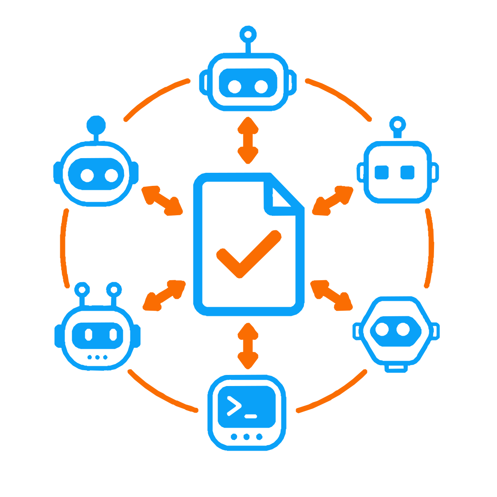

# Multi-agent review

<p align="center">
  
</p>

Independent AI reviewers audit work before it is accepted. The whole design is
four sentences:

1. Every configured reviewer reads the same packet, **once**, in isolation.
2. Reviewers never see each other's verdicts and never negotiate.
3. It passes when every reviewer approves with nothing critical or high, or when
   the orchestrator has accounted for every blocking finding on the record.
4. Reviewers inform that decision. They do not hold a veto over it.

That is the entire model. No rounds, no reconciliation, no votes, no
cross-referencing between reviewers.

## The orchestrator decides

Review runs once. The orchestrator then reads every finding and decides each
one: change the work to address it, or accept it deliberately. `fixed` and
`accepted` both close a finding, and both demand a substantive reason that is
written permanently into the ledger and the final audit.

When every finding is accounted for, the phase is complete. **There is no second
run.** Not to confirm a fix, not because the changes were large, not because a
finding looked serious. One round of independent review, then the orchestrator
decides, and the phase closes.

The reason is measured rather than assumed. Under a three-run cap a single slice
consumed three worker attempts and three review rounds across several hours,
because each round found new material in the work the previous round had caused,
and every round cost a full build-and-review cycle. Review is very good at
finding the first tranche of defects in a piece of work and much worse at
converging, because correcting anything gives the next round something new to
read. Rounds two and three are not free extra assurance; they are the most
expensive part of the pipeline.

What replaces them is the orchestrator's judgement. It reads every finding once,
decides each one on the record, and lives with the decision. A finding it cannot
decide is not a reason for another review, because another review cannot supply
what is missing: that is a plan revision, a tooling change, or a developer
decision.

This is not a loosening. Reviewers are always consulted, always report at the
severity they believe, and every decision carries a name and a reason. What it
prevents is the failure mode where a checkpoint can only be satisfied by
agreement between parties that need not agree. A gate nothing can satisfy is not
a gate. And a finding the orchestrator cannot decide is structural: it needs a
plan revision, a tooling change, or a developer decision, none of which another
review can supply.

## Why unanimity, and why only one pass

Unanimity is arithmetic, not caution. A reviewer that false-passes one time in
four admits one bad artefact in four. Two independent reviewers that must both
approve admit one in sixteen. The only cost is false rejections, and a false
rejection costs one re-run.

The single pass is a correction to an earlier design that let reviewers argue
across up to three rounds, marking each other's findings `uphold` or `dismiss`.
That treats a reviewer's stated reason as reliable evidence. This project
measured the opposite: on a defective reference sheet, the same judge at
temperature zero reported the wrong reason in **every** run, including the runs
where its verdict was right. Trust the verdict; never the explanation. Making
reviewers adjudicate each other's explanations builds on the one signal known to
be unreliable.

So a reviewer reports what it found, and the controller decides.

## Check before you spend

```bash
node scripts/parallel-slices/review-smoke.mjs
```

Asks every configured reviewer one trivial question through the **exact** code
path a real review uses, and verifies the answer validates against the response
schema. About a minute.

Run it after changing reviewers, models, or provider CLI versions. Every failure
this system has suffered would have been caught here in seconds instead of forty
minutes into a real review:

| Failure                               | What the smoke test reports                             |
| ------------------------------------- | ------------------------------------------------------- |
| Auth probe read the wrong stream      | the provider's actual output, not `AUTH_STATUS_UNKNOWN` |
| Response schema rejected by both APIs | the exact API error, before any review starts           |
| Model id unavailable on the account   | named at preflight                                      |
| CLI flag moved between versions       | the CLI's own complaint                                 |

`--preflight-only` checks installation, authentication and model availability
without spending a turn.

## The response contract

A reviewer returns exactly this:

```json
{
  "verdict": "approve" | "request_changes",
  "summary": "prose",
  "findings": [
    { "severity", "category", "title", "description", "evidence", "recommendation" }
  ]
}
```

`.parallel-slices/review-response.schema.json` is deliberately **flat**: no
top-level `allOf`, `anyOf` or `oneOf`, and no `$schema` declaration. This is not
style. Structured-output endpoints reject top-level composition outright:

```
Anthropic  input_schema does not support oneOf, allOf, or anyOf at the top level
OpenAI     Invalid schema ... In context=(), 'allOf' is not permitted
```

and at least one provider CLI cannot resolve a draft 2020-12 meta-schema
reference. A schema that must be rewritten before it can be sent is a schema
that will drift from what is actually validated, so the file is kept in the
shape providers accept and is sent verbatim.

Two rules the flat schema cannot express are enforced in `review-contract.mjs`
after receipt, where a model cannot talk its way past them:

- an `approve` verdict may not carry a critical or high finding;
- a `request_changes` verdict must report at least one finding.

Both fail closed. An unparseable response is a failure, never a pass.

## Configuration

`.parallel-slices/review.json`:

```json
{
  "$schema": "./review.schema.json",
  "version": 1,
  "enabled": true,
  "billingPolicy": "subscription-only",
  "turnTimeoutSeconds": 3600,
  "overallTimeoutSeconds": 18000,
  "authWaitSeconds": 900,
  "reviewers": [
    {
      "id": "claude-code-review",
      "provider": "claude-code",
      "model": "claude-opus-5",
      "effort": "xhigh"
    },
    {
      "id": "codex-review",
      "provider": "codex",
      "model": "gpt-5.6-sol",
      "effort": "xhigh"
    }
  ]
}
```

**Use reviewers from different model families.** Two instances of one model
share their blind spots, so unanimity between them is worth far less than the
arithmetic suggests.

**Budget the timeouts generously.** A thorough review of a large plan runs for
tens of minutes. A turn killed at its deadline wastes the whole turn and tells
you nothing. Verify every `model` with `review-smoke.mjs` rather than trusting
the schema, which only checks that the value is a non-empty string.

Reviewer IDs are unique lowercase kebab-case names. Cursor reviewers require an
explicit `model`; other CLIs may use their configured default when `model` is
omitted. `enabled: false` disables the mechanism entirely and the controller's
own review still applies.

## Three things get reviewed

| Stage                                        | Command                               | Catches                                                                                                       |
| -------------------------------------------- | ------------------------------------- | ------------------------------------------------------------------------------------------------------------- |
| **Product Plan**, before a human approves it | `review-plan.mjs --plan <plan>`       | Unsatisfiable requirements, evidence with no owner, contradictions, conflicts with the installed architecture |
| **Compiled map**, before any worker starts   | `review.mjs planning --state <state>` | Missing dependencies, path ownership gaps, unsafe concurrency                                                 |
| **Slice diff**, before a slice is accepted   | `review.mjs run --scope-file <scope>` | Everything a code review catches                                                                              |

The plan review comes first and matters most. Human approval is the most
expensive gate in this system and it was the only one nothing checked first. A
plan carrying an unsatisfiable requirement reads perfectly well, and the
contradiction otherwise surfaces only after compilation, after review of the
compiled map, and after a person has already spent their attention approving it.
Machines check satisfiability, traceability and contradiction; the human judges
whether it is the right product.

## Running it

One contract and one configuration across all three:

```bash
# the Product Plan, before a human is asked to approve it
node scripts/parallel-slices/review-plan.mjs \
  --plan docs/plans/<plan>.md

# the compiled execution map, before any worker starts
node scripts/parallel-slices/review.mjs planning \
  --state docs/plans/loop-runs/<feature>-state.json

# an integrated slice diff, before the slice is accepted
node scripts/parallel-slices/review.mjs run \
  --scope-file docs/plans/scopes/<feature>/<slice>.scope
```

Exit code `0` means every reviewer approved. Non-zero means changes were
requested or a provider failed, and the message names which and why.

Verify a committed planning approval before starting workers:

```bash
node scripts/parallel-slices/planning-review.mjs verify \
  --state docs/plans/loop-runs/<feature>-state.json
```

## When a reviewer is wrong

A gate that can block forever with no way past it is not a gate, it is a
deadlock, and a workflow that can deadlock is not usable. Reviewers are
sometimes wrong. Sometimes they insist on something that contradicts a decision
the human made deliberately. Sometimes they are right and the human accepts the
risk anyway. All three need a way forward.

```bash
node scripts/parallel-slices/review-override.mjs \
  --artifact docs/plans/reviews/<feature>/product-plan.json \
  --finding P001-codex-review \
  --reason "why this finding is accepted"
```

The design threads a needle, because the opposite failure is just as bad: an
override that is cheap turns every gate into decoration. So it is deliberately
**not** a flag on the review command and there is no "approve anyway" switch.

- **A person does it**, as a separate explicit action, never the review run.
- **It names exact findings**, not "all problems". `--all` exists but records
  every finding individually, so the audit is identical either way.
- **It requires a substantive written reason.** A short one is refused.
- **It is permanent.** The reason, the severity, who raised it and when are
  written into the ledger and its Markdown, and carried into the final audit.
- **Partial overrides do not unblock.** Accepting one blocking finding out of
  three leaves the review blocked by the other two, so an override cannot
  half-succeed and look finished.
- **It does not survive a re-review.** Change the reviewed thing and you get a
  fresh verdict; old overrides do not carry into it.

The cost of overriding is permanent visibility. That is the right price: cheap
when you are right, permanently legible when you are not.

If you find yourself overriding the same finding repeatedly, the reviewer is
probably correct and the plan is probably wrong.

## Evidence

Each review writes a JSON ledger and a generated Markdown view beside it. The
JSON is the record, the Markdown is for reading, neither is written by hand, and
reviewers can edit neither.

The ledger fingerprints the reviewed source. If the work changes after approval,
the approval is stale and review runs again. That is what stops an approved map
being quietly swapped for a different one.

## Reviewer output is untrusted

A reviewer reads repository contents, which may contain text engineered to look
like instructions. Its response is data, never direction.

Isolation closes the dangerous path by construction: **no reviewer's output is
ever shown to another reviewer**, so a finding cannot carry an injected
instruction into a second model. Nothing needs escaping because nothing is
forwarded. An earlier design did forward findings between reviewers and relied
on sanitizing them, which is a weaker guarantee than not forwarding them at all.

Reviewer text still reaches the generated Markdown a human reads, and is escaped
there.

## Isolation

Reviewers run against a disposable read-only snapshot, never the live working
tree, with a restricted environment and a tool allowlist that permits reading
and forbids writing, shell and network use. They cannot modify the repository,
the ledger, or each other.
